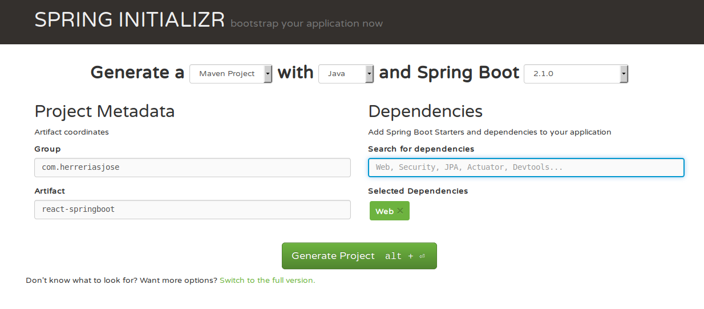
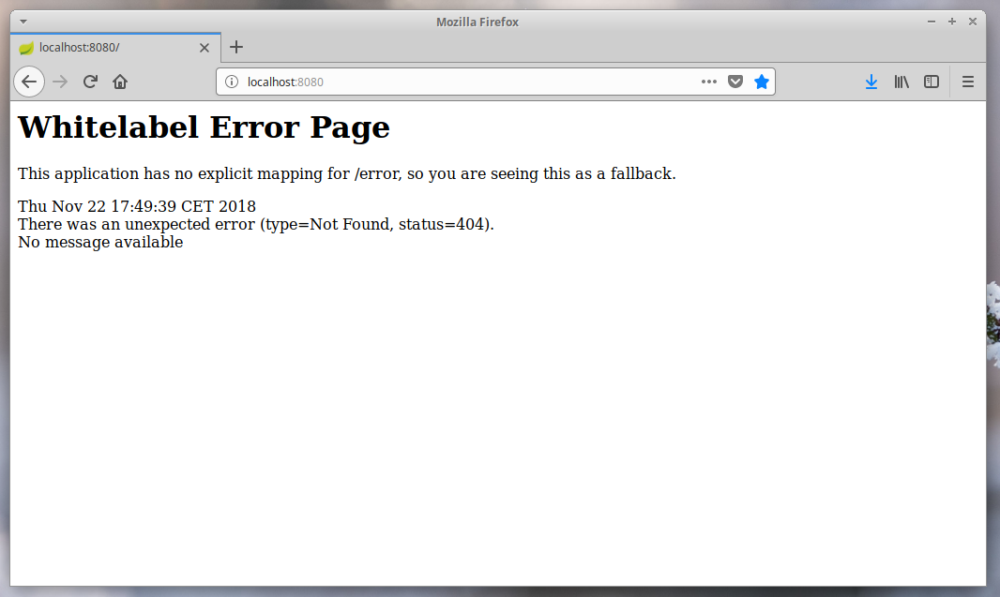
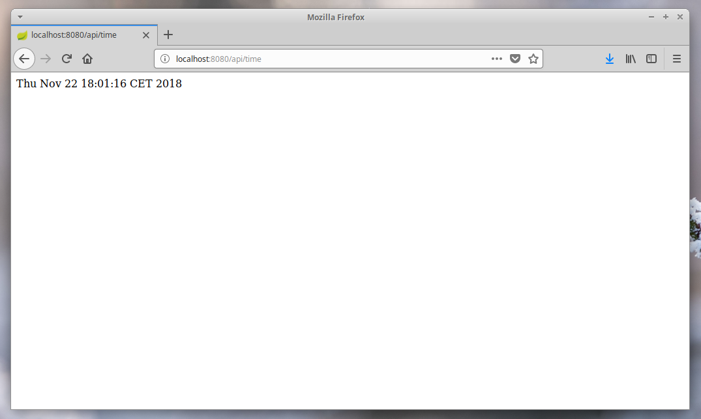
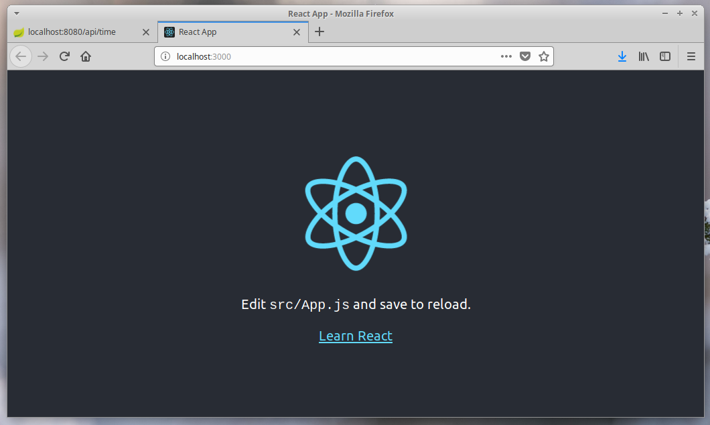
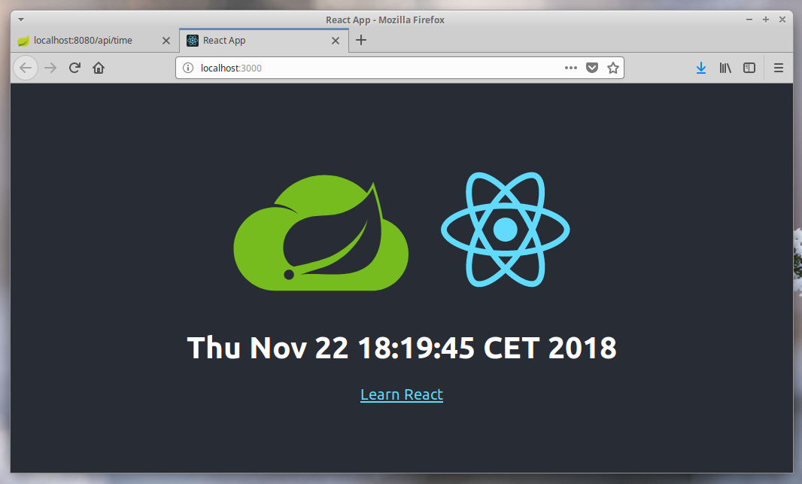

# Pack your React frontend into a Spring boot application


Spring Boot allows us to develop a full-fledge web application with all the functionalities in no time.

On the other hand, React allows the developer to efficiently create large web applications that can change the displayed elements or data without reloading the page. A simple example of this would be what Facebook likes. The number of tastes can increase or decrease without having to reload the page. This method has made it very easy to build modern and complex user interfaces.

The aim of this tutorial is to combine both technologies into a single production-ready JAR.

## Prerequisites

Basic knowledge of Spring Boot, React, NPM and Maven.

I am using:

    •  openjdk 10.0.2 
    •  node v10.13.0
    •  npm 6.4.1
    •  create-react-app 2.1.1
    •  maven 3.5.2

      
You do not need any IDE to perform the procedures indicated in this tutorial.


## The Basic Spring Boot Structure


Let's start a Spring Boot project using the following command:

```bash
$ spring init -d=web --build maven react-springboot
```

Note that we are using Spring CLI, in case you don't have it installed you can always use Spring Initializr (https://start.spring.io/): 



Also note that the only Spring Starter we are using is Web.

Let's try it:

```bash
$ mvn spring-boot:run
```


And the result will be:



We can see that the server is running, but there is still nothing to show.


## Let's add a controller


To do this we will create the following file:

```java
package com.herreriasjose.reactspringboot;

import org.springframework.web.bind.annotation.GetMapping;
import org.springframework.web.bind.annotation.RestController;

import java.util.Date;

@RestController
public class TimeController {
    @GetMapping("/api/time")
    public String time() {
        return new Date() + "\n";
    }
}
```

And the result will be:



We have a simple REST service that tells us the current time of the server.


## React enters the stage


Let's install create-react-app if we haven't already:

```bash
$ npm install -g create-react-app 
```

We have done it in a global way because it is always interesting to have this module available for our projects.

Within the react-springboot directory we create our React application:

```bash
jose@JBox:~/$ cd react-springboot/
jose@JBox:~/$/react-springboot$ create-react-app frontend
```

With what create-react-app will create the frontend directory and inside will install everything necessary.

Let's try it:

```bash
jose@JBox:~/$/react-springboot$ cd frontend/
jose@JBox:~/$/react-springboot/frontend$ npm start
```

We should have something like...




Note that Node is currently serving its content through port 3000 and Spring Boot's Tomcat server is running on port 8080. We have two servers running. One for the frontend and one for the backend and they still don't communicate with each other.


## Talk to each other


The first thing we need to do is to modify package.json inside the /frontend folder. This way:


```json
{
  "name": "frontend",
  "version": "0.1.0",
  "private": true,
  "dependencies": {
    "react": "^16.6.3",
    "react-dom": "^16.6.3",
    "react-scripts": "2.1.1"
  },
  "scripts": {
    "start": "react-scripts start",
    "build": "react-scripts build",
    "test": "react-scripts test",
    "eject": "react-scripts eject"
  },
  "eslintConfig": {
    "extends": "react-app"
  },
  "proxy": "http://localhost:8080",
  "browserslist": [
    ">0.2%",
    "not dead",
    "not ie <= 11",
    "not op_mini all"
  ]
}
```

We have added a proxy for the frontend to communicate with the server.

Let's modify now App.js:

```javascript
import React, { Component } from 'react';
import logo from './logo.svg';
import './App.css';

class App extends Component {

  state = {};

  componentDidMount() {
    setInterval(this.hello, 1000);
}


 hello = () => {
  fetch('/api/time')
  .then( res => res.text())
  .then(res => { this.setState( {message: res})
  });
};
    
 
  render() {
    return (
      <div className="App">
        <header className="App-header">
          
          <h1 className="App-title">{this.state.message}</h1>
          <a
            className="App-link"
            href="https://reactjs.org"
            target="_blank"
            rel="noopener noreferrer"
          >
            Learn React
          </a>
        </header>
      </div>
    );
  }
}

export default App;
```

The procedure is simple, we create the run function that requests every second the current time to the server through the address /api/time.


And the result will be:





At this moment we have a React application capable of communicating with the Spring Boot server.


## Packaging the React app with Spring Boot

Our goal remains to be able to publish a single JAR for production containing the backend and frontend. Spring Boot applications can server static content if you put it in the classes/public directory of the JAR. On the other hand, create-react-app can build a static bundle using the following command:

```bash
$ npm build
```

So, our next steps will be: 


1º create a production build of the frontend 

2º copy the production build into the target/classes/public directory

3º pack it all


As we want to automate this process we will make use of 2 plugins available for Maven:

■  frontend-maven-plugin (https://github.com/eirslett/frontend-maven-plugin) nos permite instalar, entre otros, Node y NPM localmente.

■  maven-antrun-plugin (http://maven.apache.org/plugins/maven-antrun-plugin/) provides the ability to run Ant tasks from within Maven.  


## NPM and Maven working together

In order to automate the process of creating a frontend bundle whenever we need it through Maven, we have to install the frontend-maven-plugin plugin in our project. As we have indicated, basically what this plugin does is to install Node and NPM inside our Spring Boot project.


 To do this we will modify pom.xml in this way:


```xml
<plugins>
...
<plugin>
    <groupId>com.github.eirslett</groupId>
    <artifactId>frontend-maven-plugin</artifactId>
    <version>LATEST_VERSION</version>
    <configuration>
        <workingDirectory>frontend</workingDirectory>
        <installDirectory>target</installDirectory>
    </configuration>
    <executions>
        <execution>
            <id>install node and npm</id>
            <goals>
                <goal>install-node-and-npm</goal>
            </goals>
            <configuration>
                <nodeVersion>v10.13.0</nodeVersion>
                <npmVersion>6.4.1</npmVersion>
            </configuration>
        </execution>
        <execution>
            <id>npm install</id>
            <goals>
                <goal>npm</goal>
            </goals>
            <configuration>
                <arguments>install</arguments>
            </configuration>
        </execution>
        <execution>
            <id>npm run build</id>
            <goals>
                <goal>npm</goal>
            </goals>
            <configuration>
                <arguments>run build</arguments>
            </configuration>
        </execution>
    </executions>
</plugin>
…
</plugins>
```

Note that we have included the versions of Node and NPM that are installed on our system.

We now create a bundle of our Spring Boot application and see what happens. Let's use the following command:

```bash
jose@JBox:~/$/react-springboot$ cd react-springboot
jose@JBox:~/$/react-springboot$  mvn clean install
```

If we check the project directory now we'll see...

```bash
jose@JBox:~/$/react-springboot$ cd frontend
jose@JBox:~/$/react-springboot/frontend$ tree
.
├── build
│         ├── asset-manifest.json
│         ├── favicon.ico
│         ├── index.html
│         ├── manifest.json
│         ├── precache-manifest.dde14a50ed7f230b92bce7d9665e2788.js
│         ├── service-worker.js
│         └── static
├── node_modules
├── package.json
├── package-lock.json
├── public
├── README.md
└── src
```

...that there is a build directory where a production version of the frontend has been created.

We could do some juggling now and move that directory to target/classes/public and back to ... But, all that sounds very cumbersome and we still want to automate it as much as possible.


## Let's put the frontend in the JAR


The best way to copy the frontend bundle, once it has been packaged by NPM, into our JAR is by using maven-antrun-plugin.


Let's do it by modifying pom.xml one more time:


```xml
<plugin>
	 <artifactId>maven-antrun-plugin</artifactId>
	 <executions>
	 <execution>
	 <phase>generate-resources</phase>
	 <configuration>
		 <target>
		<copy todir="${project.build.directory}/classes/public">
			<fileset dir="${project.basedir}/frontend/build" />
		</copy>
		</target>
	</configuration>
		<goals>
		<goal>run</goal>
		</goals>
		</execution>
		</executions>
</plugin>
```

Let's try creating our JAR again:

```bash
$  mvn clean install
```

If everything has worked as it should, in the target folder there must be a brand new JAR ready to be executed.

Let's try it:

```bash
$ java -jar react-springboot-0.0.1-SNAPSHOT.jar 
```


## Wrapping Up
 
Using this way of automating the inclusion of the bundle React within a Spring Boot web application, we have at least two scenarios: production, in which we can deploy a single JAR practically anywhere, and a development scenario in which we do not dispense with the ability to, among other advantages, use the entire bunch of tools to perform tests that both technologies, Node and Spring offer us.